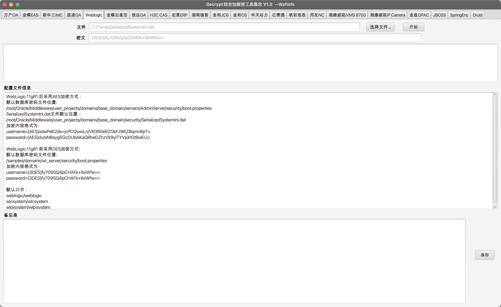
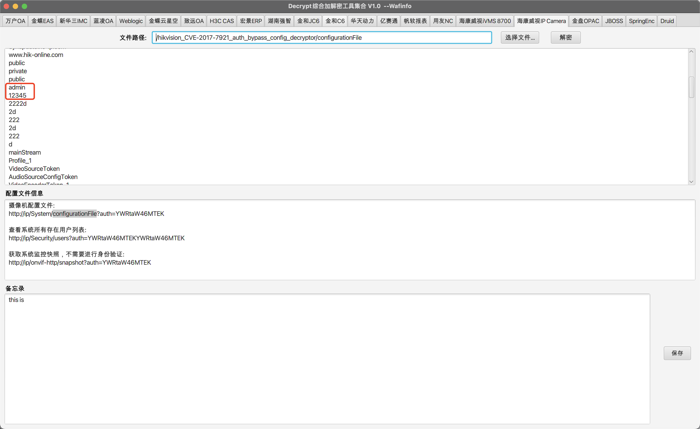
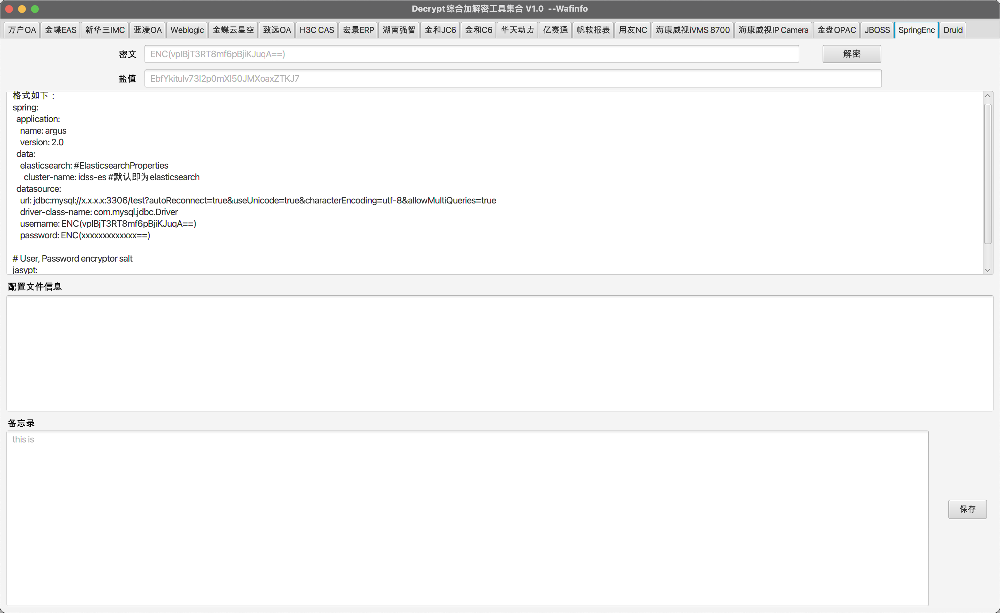
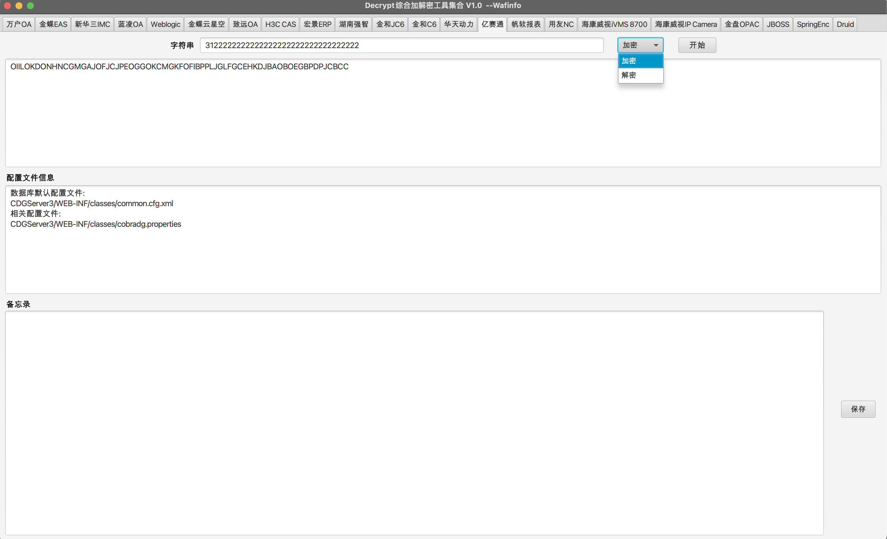
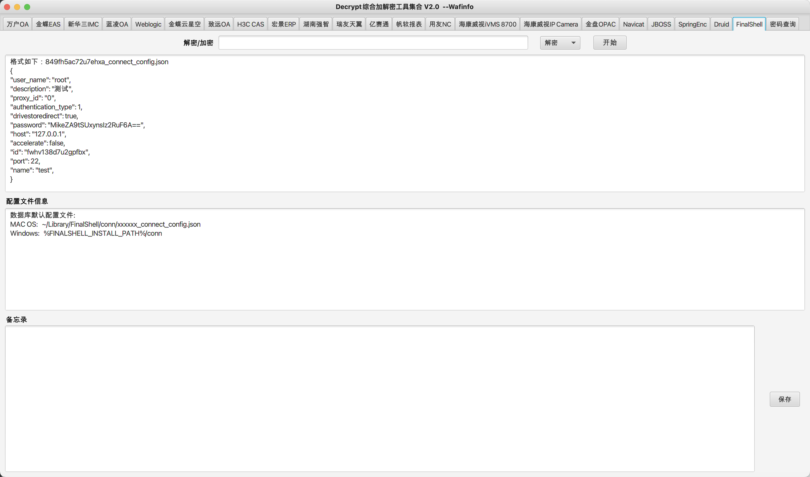
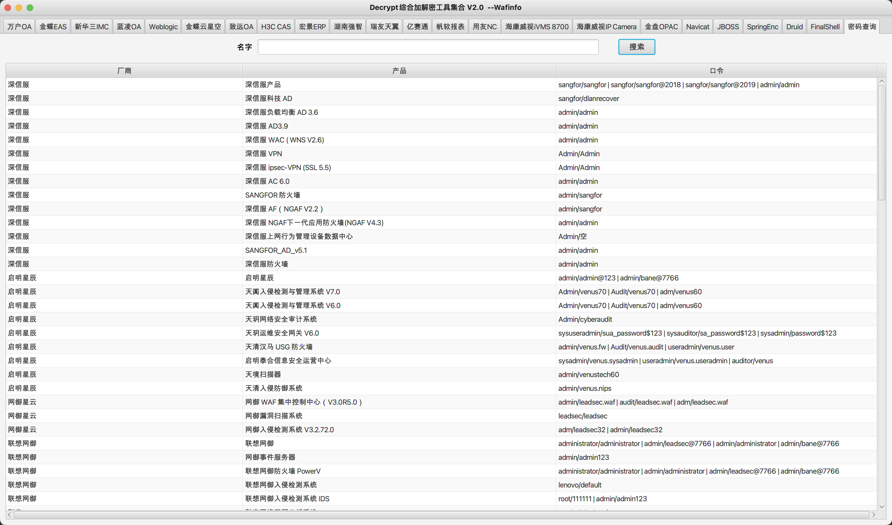
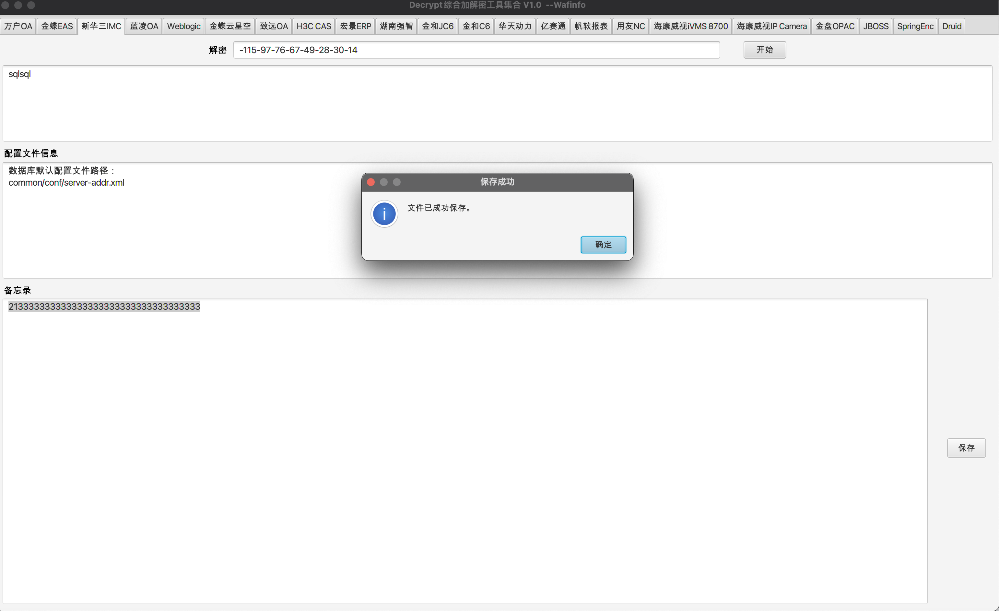
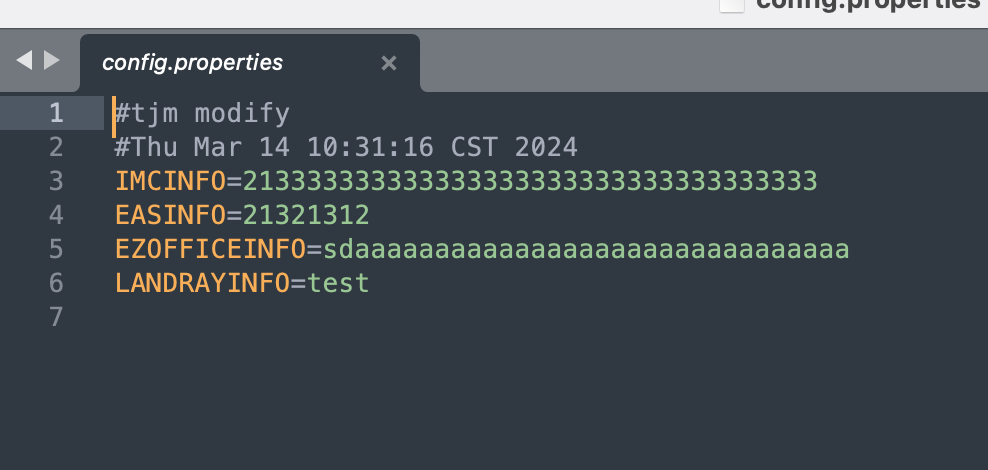

<h1 align="center" >DecryptTools综合解密</h1>

<h3 align="center" >一款针对加解密综合利用后渗透工具</h3>

##  👮🏻‍♀️ 免责声明

由于传播、利用DecryptTools综合解密工具提供的功能而造成的**任何直接或者间接的后果及损失**，均由使用者本人负责，本人**不为此承担任何责任**。

## **前言**

为什么会写这一款综合加解密工具，因为在很多比赛如果算**拿下靶标**不仅**需要获取服务器权限还需要登录网站后台**这时候很多系统**要么数据库连接字符串加密，要么登陆用户加密**而这款工具就是为了解决问题。

**加解密功能**：该工具不仅有**解密**还提供**多种加密**方式。

**配置文件信息功能**：为了在**比赛中尽可能节约时间和提供一个后渗透功能。**

**备忘录功能：**是为了**保存用户自己有一些trick点方便查看，同时也保证自己trick不被公开化**。

## 工具展示

- ## **支持22种加解密+密码查询功能**

* 万户OA
* 用友NC
* 金蝶EAS
* 蓝凌OA
* 致远OA
* 宏景ERP
* 湖南强智
* ~~金和jc6~~    瑞友天翼
* ~~金和C6~~     Navicat
* ~~华天动力~~  FinalShell
* 亿赛通
* 帆软报表
* H3C CAS
* Weblogic
* 金蝶云星空   
* 新华三IMC
* 金盘 OPAC
* 海康威视IVMS 8700
* 海康威视IP Camera
* 海康威视综合安防平台(iSecure) (支持全平台)
* JBOSS
* SpringEnc
* Druid
* 密码查询功能

## **更新历程**

**2024/9/30 DecryptTools综合解密V3.0**

* 修复 密码查询 字段添加乱序问题。
* 增加 帆软报表10/11 数据库解密。
* 更新 帆软报表解密UI。
* 更新 帆软报表配置文件描述信息。
* 增加 蓝凌EIS 用户密码解密。
* 增加 致远OA GZIP压缩和解压。 
* 更新 瑞友天翼 配置文件信息描述。
* 修复 海康威视IVMS 8700解密，抽离出核心代码，不在使用dll文件。

**2024/7/1 DecryptTools综合解密V2.4**

* 修复 Windows打开DecryptTools工具全屏问题。
* 增加 致远OA  全文件解密功能。
* 增加 致远OA  /2.4数据库密码解密功能。
* 更新 致远OA  配置文件描述。
* 删除 用友用户 密码爆破功能。
* 增加 用友NC65 密码加密功能。
* 增加 用友YonBip 密码加密功能。
* 增加 用友NCCLOUD 密码加密功能。
* 更新 用友 配置文件信息添加更详细后渗透利用方式。
* 更新 海康威视综合安防平台(iSecure)  配置文件描述，添加更细节化后渗透利用。
* 更改 名SpingENC为Jasypt并添加两种解密。
* 更新 Jasypt 配置文件信息描述。
* 调整UI。

**2024/4/25 DecryptTools综合解密V2.3**

* 修复 金蝶 K3 Cloud云星空 数据库加解密问题。
* 增加 金蝶 K3 Cloud云星空 数据库用户加密替换。
* 修复 宏景ERP 加解密问题。
* 增加 蓝凌(Landry)  SM4 加解密支持。
* 增加 蓝凌(Landry)  Token 解密支持。
* 更新 蓝凌(Landry)  整体加解密UI。
* 增加 用友 数据库内用户密码破解。
* 增加 用友 传输数据包加解密。
* 增加 海康威视综合安防平台(iSecure) 加解密 (支持全平台)。
* 更新 密码查询，支持自定义添加，复制和删除数据。
* 整合 海康威视综合安防平台(iSecure) 、IP Camera和iVMS 8700 为海康威视集合，并更新UI。

**2024/3/20 DecryptTools综合解密V2.0**
* 修复 部分已知UI问题。
* 增加 部分配置内容格式提示。
* 增加 Navicat解密支持11及12以上版本。
* 增加 FinalShell远程连接工具解密。
* 增加 瑞友天翼数据库解密和用户NT解密。
* 暂时下线 金和J6、金和C6和华天动力(后续会上线)。
* 增加 密码查询功能。

## 🕳️ **工具加解密**

## 🕳️ **备忘录**

保存的内容均在同级目录`config.properties`文件中

## 参考文章

https://www.cnblogs.com/kexianting/p/11689289.html

https://github.com/jas502n/spring-ENC

https://github.com/chrisjd20/hikvision_CVE-2017-7921_auth_bypass_config_decryptor/

https://github.com/Rvn0xsy/PassDecode-jar

https://www.hedysx.com/2807.html

https://github.com/zhutougg/LandrayDES

https://cloud.tencent.com/developer/article/2204689

https://github.com/TideSec/Decrypt_Weblogic_Password

https://github.com/baogod404/HikvisionDecode

https://github.com/TalentKrico/navicat_password_decrypt

https://github.com/NULLB8/seeyonDecrypt

https://www.t00ls.com/viewthread.php?tid=70588

https://github.com/jas502n/FinalShellDecodePass/blob/main/FinalShellDecodePass.java

https://github.com/BaizeSec/bylibrary/blob/main/docs/%E9%80%9F%E6%9F%A5%E8%A1%A8/%E5%B8%B8%E8%A7%81%E4%BA%A7%E5%93%81%E5%BC%B1%E5%8F%A3%E4%BB%A4.md
